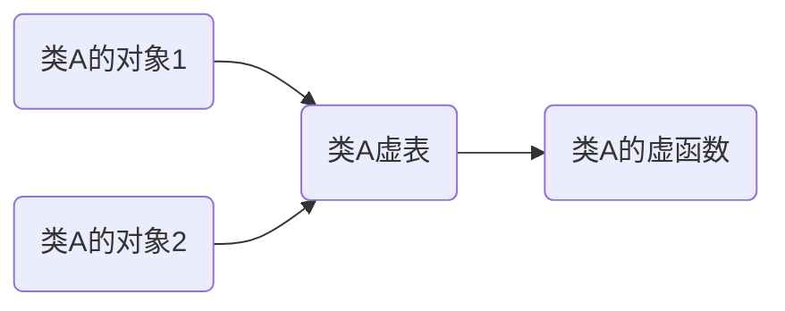

+++
title = "Rust编写几种hook的方式"
date = 2024-03-22T15:59:44+08:00

[taxonomies]
tags = ["retour", "inline hook", "vmt hook", "iat hook", "rust", "hook"]
categories = ["Reverse"]
+++

使用Rust编写几种在windows上常用的hook方式:

- IAT hook
- Inline hook
- VMT hook

为什么要用rust的不用c++？就是想用，想给自己找麻烦😎

<!-- more -->

# Rust windows-rs 库使用

早年的教程大多是使用`winapi`这个库，后来微软官方发布了`windows-rs`，我就选定用官方的库来做。下面是rust库的一写基础知识

## features

**什么是features？**

在安装库的时候大多是时候我们都是`cargo add <库名称>`安装一整个库，编译的时候也就整个库参与编译，而`features`则可以进一步选择库中特定的模块，手动在`Cargo.toml`添加即可

```toml
[dependencies]
windows-sys = { version = "0.52.0", features = [
    "Win32_UI_WindowsAndMessaging",
    "Win32_System_LibraryLoader",
    "Win32_System_Memory",
    "Win32_Foundation",
    "Win32_System_SystemServices",
    "Win32_System_SystemInformation",
    "Win32_System_Diagnostics_Debug",
    "Win32_Security",
    "Win32_System_Threading",
] }
```

比如`windows-sys`就有很多个features，不同的api处于不同的feature下，需要添加后才可以编译

**查看API/结构体对应的fearture**

这个一般要看文档，我这里搜索对应feature是，windows-rs库文档中专门提供了一个搜索api对应feature的地方

https://microsoft.github.io/windows-rs/features/#/0.53.0


**windows & window-sys**

windows -rs库下有两个版本，一个是windows，一个是windows-sys。区别是sys更底层一些，windows封装的更多一些.

## 32位 & 64位 & DLL

在windows上编译32位的需要rustup添加一个交叉编译平台。

查看所有交叉编译平台

```shell
rustup target list
```

我是64位 win11，安装一个32的交叉编译

```shell
rustup target add i686-pc-windows-msvc
```

编译32位程序

```shell
cargo build --target=i686-pc-windows-msvc
```

如果报错找不到linker，需要在cargo.toml中配置一下linker，根据自己的路径来配置

```toml
[target.i686-pc-windows-msvc]
linker = "C:\\Program Files (x86)\\Microsoft Visual Studio\\2019\\BuildTools\\VC\\Tools\\MSVC\\14.24.28314\\bin\\Hostx64\\x86\\link.exe"
```

然后编译成**dll**则需要在cargo.toml中添加如下内容

```toml
[lib]
crate-type = ["cdylib"]
```

# IAT hook

导入表hook，什么是导入表？当PE程序调用dll中的函数时，就要去自己的导入表中查找dll中函数地址，这个IAT表在程序初始化中就初始化好了。

可以通过CFF exploer来查找你想hook的函数在那个dll中


hook的思路也很简单，就是替换掉表中的函数指针值，修改成我们的函数地址


现在假设我们的目标就是hook一个程序中的`MessageBoxA`函数

**IAT hook 先决条件**

1. 首先目标程序需要调用了`MessageBoxA`函数
2. 这个程序需要调用IAT表中的`MessageBoxA`

C++版本的代码有很多，可以参考[Red Team Note](https://www.ired.team/offensive-security/code-injection-process-injection/import-adress-table-iat-hooking)的版本

关键部分是定位到IAT表然后遍历表项，定位IAT表需要做一个PE头的解析，或者说偏移，具体如下

首先通过DOS头的`e_lfanew`（最后4个字节）定位到NT头

```rust
let image_base = GetModuleHandleA(null()) as u64;
let p_dos_header = image_base as PimageDosHeader;
let p_nt_headers = (image_base + (*p_dos_header).e_lfanew as u64) as PimageNtHeaders64;
```

然后NT头的`OptionalHeader-->DataDirArray`中第2项就是导入表的偏移，同理可以得到其他表，具体有哪些表可以查文档，下面是010editor截图


然后遍历对比导入表中的模块名是否和目标模块相同，相同则继续遍历模块中的函数名，直到匹配到目标函数。

匹配到目标函数也就是`MessageBoxA`后，修改权限，再修改函数指针，再修改回原来的权限(养成好习惯，不留下烂摊子)

```rust
/* 修改IAT表属性为可读可写可执行, 然后修改对应IAT表项值为hook函数 */
/* 由于只是修改IAT表中的一个指针，所以大小直接0x1000，不会有大小的限制 */
let mut old_protection = 0u32;
VirtualProtect(p_func as _, 0x1000, PAGE_EXECUTE_READWRITE, &mut old_protection as _);
*p_func = new_func_address;
VirtualProtect(p_func as _, 0x1000, old_protection, &mut old_protection as _);
```

这样就可以了，需要记得再实现一个自定义的`new_func_address`也就是我们自己hook的函数

```rust
unsafe extern "system" fn hook_message_box_a(h_wnd: HWND, _: PCSTR, _: PCSTR, u_type: u32) -> i32 {
    (*(&MESSAGE_BOX_A_HOOK_ADDRESS as *const _ as MessageBoxWHook))(
        h_wnd,
        s!("Ops hooked by mi1itray.axe!"),
        s!("Ops hooked by mi1itray.axe!"),
        u_type,
    )
}
```

Rust版本64位代码如下:

```rust
use core::ptr::null;
use std::os::raw::c_void;
use windows_sys::{
    core::*, Win32::Foundation::*, Win32::System::Diagnostics::Debug::IMAGE_NT_HEADERS64,
    Win32::System::LibraryLoader::*, Win32::System::Memory::*, Win32::System::SystemServices::*,
    Win32::UI::WindowsAndMessaging::*,
};

// 定义一个别名
type MessageBoxWHook = *const unsafe extern "system" fn(HWND, PCSTR, PCSTR, u32) -> i32;
type LPVOID = *mut c_void;
type PimageNtHeaders64 = *mut IMAGE_NT_HEADERS64;
type PimageImportDescriptor = *mut IMAGE_IMPORT_DESCRIPTOR;
type PimageDosHeader = *mut IMAGE_DOS_HEADER;

// 保存原函数地址，当然这里可以用指针具体写法后面单独介绍
static mut MESSAGE_BOX_A_HOOK_ADDRESS: u64 = 0;

// 两个调试的时候使用的函数，用于输入Error信息
#[allow(dead_code)]
unsafe fn clear_last_error() {
    SetLastError(0);
}

#[allow(dead_code)]
unsafe fn show_last_error() {
    let e = format!("{:?}\0", GetLastError()).as_ptr();
    MessageBoxA(0, e, s!("Warn"), MB_OK);
}

/// `hook_message_box_a`是我们自定义的messagebox函数，用于替换掉原来的`MessageBoxA`函数
/// 效果是弹出一个消息框，主体内容和标题栏内容都是**Ops hooked by mi1itray.axe!**
///
/// # 参数
///
/// 参数与原本的`MessageBoxA`函数声明相同
unsafe extern "system" fn hook_message_box_a(h_wnd: HWND, _: PCSTR, _: PCSTR, u_type: u32) -> i32 {
    (*(&MESSAGE_BOX_A_HOOK_ADDRESS as *const _ as MessageBoxWHook))(
        h_wnd,
        s!("Ops hooked by mi1itray.axe!"),
        s!("Ops hooked by mi1itray.axe!"),
        u_type,
    )
}

/// `detour`执行hook逻辑的函数，将指定模块中指定偏移值的函数指针替换成指定的新函数地址值。
/// 首先遍历模块列表，直到对比出相同的模块名称。然后
///
/// # 参数
///
/// - `module_name`: 指向模块名称内存的指针，类型是`*const u8`
/// - `old_func_offset`: 原本函数指针在模块上IAT表中的偏移
/// - `new_func_address`: 替换的函数指针地址值
///
/// # 返回值
///
/// 如果hook成功则返回原始函数的地址，如果失败则返回0
///
/// # 例子
///
/// ```rust
/// detour("USER32.dll\0".as_ptr() as _, 0x72AD0, hook_message_box_w as _);
/// ```
unsafe fn detour(module_name: *const u8, old_func_offset: u64, new_func_address: u64) -> u64 {
    let module_address = GetModuleHandleA(module_name) as u64;
    let old_func_address = module_address + old_func_offset;

    let image_base = GetModuleHandleA(null()) as u64;
    let p_dos_header = image_base as PimageDosHeader;
    let p_nt_headers = (image_base + (*p_dos_header).e_lfanew as u64) as PimageNtHeaders64;
    let mut p_import_descriptor = (image_base
        + (*p_nt_headers).OptionalHeader.DataDirectory[1].VirtualAddress as u64)
        as PimageImportDescriptor;

    while (*p_import_descriptor).FirstThunk != 0 {
        /* 对比导入表项名称与目标是否符合，不符合则直接偏移导入表下一项 */
        if module_name.eq(&((image_base + (*p_import_descriptor).Name as u64) as *const u8)) {
            p_import_descriptor = p_import_descriptor.offset(1);
            continue;
        }

        /* 匹配到目标模块, 弹出一个消息框 */
        let module_name = (image_base + (*p_import_descriptor).Name as u64) as *const u8;
        MessageBoxA(0, module_name, s!("Module name"), MB_OK);

        /* 遍历导入表 */
        let mut p_func = (image_base + (*p_import_descriptor).FirstThunk as u64) as *mut u64;
        for i in 0.. {
            if p_func.is_null() {
                return 0;
            }

            /* 匹配到导入表函数，弹出一个消息框 */
            let func_name = PCSTR::from(
                (image_base
                    + (*((image_base + (*p_import_descriptor).Anonymous.OriginalFirstThunk as u64)
                        as *const u64)
                        .offset(i))
                    + 2) as *const u8,
            );

            if old_func_address == *p_func {
                MessageBoxA(0, func_name, s!("Find Func"), MB_OK);

                /* 修改IAT表属性为可读可写可执行, 然后修改对应IAT表项值为hook函数 */
                /* 由于只是修改IAT表中的一个指针，所以大小直接0x1000，不会有大小的限制 */
                let mut old_protection = 0u32;
                VirtualProtect(
                    p_func as _,
                    0x1000,
                    PAGE_EXECUTE_READWRITE,
                    &mut old_protection as _,
                );
                *p_func = new_func_address;

                /* 修改回原来的属性 */
                VirtualProtect(
                    p_func as _,
                    0x1000,
                    old_protection,
                    &mut old_protection as _,
                );

                return old_func_address;
            }

            p_func = p_func.offset(1);
        }

        return 0;
    }

    0
}

/// `init_hook` 例程执行函数，调用`detour`函数，IAThook函数
/// 其中的`0x79730`是我本机上user32.dll中基地址到MessageBoxA的偏移值
unsafe extern "system" fn init_hook() -> u32 {
    MESSAGE_BOX_A_HOOK_ADDRESS = detour(s!("USER32.dll"), 0x79730, hook_message_box_a as _);

    0
}

#[no_mangle]
#[allow(non_snake_case)]
pub extern "system" fn DllMain(_: isize, reason: u32, _: LPVOID) -> i32 {
    match reason {
        DLL_PROCESS_ATTACH => unsafe {
            MessageBoxA(0, s!("Inject dll success"), s!("Step 1"), MB_OK);
            init_hook();
        },
        DLL_PROCESS_DETACH => (),
        DLL_THREAD_ATTACH => (),
        DLL_THREAD_DETACH => (),
        _ => (),
    }

    1
}
```

# Inline hook

inline hook是hook完这个函数后

+ 首先要将原始函数的参数值都存入栈中

+ 然后再跳转自定义hook函数

+ 执行完我们的函数后回到原始函数

+ 再恢复原始函数的参数，让原始函数继续正常运行。

目的就是减小影响。这种方法效果最好，应用场景广，没有限制；但是需要写汇编语句来将参数存入栈中，同时需要根据hook函数离hook位置来决定是要**长跳转还是短跳转**。

好在可以使用一些hook框架来降低难度，windows下c语言很多框架，detour，minihook等，rust选择就比较少，之前比较有名的是detour，但是以及停止维护了。所以我这里使用的是[retour](https://github.com/Hpmason/retour-rs)，一个detour的fork维护版本

下面是一个官方的代码，是hook `MessageBoxW`的

```rust
//! A `MessageBoxW` detour example.
//!
//! Ensure the crate is compiled as a 'cdylib' library to allow C interop.
use retour::static_detour;
use std::error::Error;
use std::ffi::c_int;
use std::os::raw::c_void;
use std::{ffi::CString, iter, mem};
use windows::core::{PCSTR, PCWSTR};
use windows::w;
use windows::Win32::Foundation::{BOOL, HANDLE, HWND};
use windows::Win32::System::LibraryLoader::{GetModuleHandleW, GetProcAddress};
use windows::Win32::System::SystemServices::{
    DLL_PROCESS_ATTACH, DLL_PROCESS_DETACH, DLL_THREAD_ATTACH, DLL_THREAD_DETACH,
};

static_detour! {
  static MessageBoxWHook: unsafe extern "system" fn(HWND, PCWSTR, PCWSTR, u32) -> c_int;
}

// A type alias for `MessageBoxW` (makes the transmute easy on the eyes)
type FnMessageBoxW = unsafe extern "system" fn(HWND, PCWSTR, PCWSTR, u32) -> c_int;

/// Called when the DLL is attached to the process.
unsafe fn main() -> Result<(), Box<dyn Error>> {
    // Retrieve an absolute address of `MessageBoxW`. This is required for
    // libraries due to the import address table. If `MessageBoxW` would be
    // provided directly as the target, it would only hook this DLL's
    // `MessageBoxW`. Using the method below an absolute address is retrieved
    // instead, detouring all invocations of `MessageBoxW` in the active process.
    let address = get_module_symbol_address("user32.dll", "MessageBoxW")
        .expect("could not find 'MessageBoxW' address");
    let target: FnMessageBoxW = mem::transmute(address);

    // Initialize AND enable the detour (the 2nd parameter can also be a closure)
    MessageBoxWHook
        .initialize(target, messageboxw_detour)?
        .enable()?;
    Ok(())
}

/// Called whenever `MessageBoxW` is invoked in the process.
fn messageboxw_detour(hwnd: HWND, text: PCWSTR, _caption: PCWSTR, msgbox_style: u32) -> c_int {
    // Call the original `MessageBoxW`, but replace the caption
    let replaced_caption = w!("Detoured!");
    unsafe { MessageBoxWHook.call(hwnd, text, replaced_caption, msgbox_style) }
}

/// Returns a module symbol's absolute address.
fn get_module_symbol_address(module: &str, symbol: &str) -> Option<usize> {
    let module = module
        .encode_utf16()
        .chain(iter::once(0))
        .collect::<Vec<u16>>();
    let symbol = CString::new(symbol).unwrap();
    unsafe {
        let handle = GetModuleHandleW(PCWSTR(module.as_ptr() as _)).unwrap();
        match GetProcAddress(handle, PCSTR(symbol.as_ptr() as _)) {
            Some(func) => Some(func as usize),
            None => None,
        }
    }
}

#[no_mangle]
unsafe extern "system" fn DllMain(_hinst: HANDLE, reason: u32, _reserved: *mut c_void) -> BOOL {
    match reason {
        DLL_PROCESS_ATTACH => {
            println!("attaching");
            unsafe { main().unwrap() }
        }
        DLL_PROCESS_DETACH => {
            println!("detaching");
        }
        DLL_THREAD_ATTACH => {}
        DLL_THREAD_DETACH => {}
        _ => {}
    };
    return BOOL::from(true);
}
```

看完我只能说，优雅，太优雅了！宛如汉尼拔做人一样的优雅。

# VMT hook

虚表hook，在c++中，一个类如果使用到了虚函数，就会有虚表。这个虚表只属于这个类，这个类的对象都有指向这个虚表的指针



先写一个简单的例子

```c++
#include <iostream>

using namespace std;

class Base
{
public:
    virtual void func1() { cout << "func1()" << endl; }
    virtual void func2() { cout << "func2()" << endl; }
    virtual void func3() { cout << "func3()" << endl; }
};

int main()
{
    Base t;
    (((void (*)()) * ((int*)(*((int*)&t)) + 0)))();
    (((void (*)()) * ((int*)(*((int*)&t)) + 1)))();
    (((void (*)()) * ((int*)(*((int*)&t)) + 2)))();
    return 0;
}
```

运行后可以看到

```sh
 ❯❯ mi1it ❯❯ .\vmt.exe
func1()
func2()
func3()
```

g++编译成x86架构的，使用ida打开分析一下

```assembly
.rdata:004052A8 ; public Base
.rdata:004052A8                 public __ZTI4Base
.rdata:004052A8 ; `typeinfo for'Base
.rdata:004052A8 __ZTI4Base      dd offset __imp___ZTVN10__cxxabiv117__class_type_infoE+8
.rdata:004052A8                                         ; DATA XREF: .rdata:004052BC↓o
.rdata:004052A8                                         ; reference to RTTI's type class
.rdata:004052AC                 dd offset __ZTS4Base    ; reference to type's name
.rdata:004052B0                 public __ZTS4Base
.rdata:004052B0 ; `typeinfo name for'Base
.rdata:004052B0 __ZTS4Base      db '4Base',0            ; DATA XREF: .rdata:004052AC↑o
.rdata:004052B0                                         ; type descriptor name
.rdata:004052B6                 align 4
.rdata:004052B8                 public __ZTV4Base
.rdata:004052B8 ; `vtable for'Base
.rdata:004052B8 __ZTV4Base      dd 0                    ; offset to this
.rdata:004052BC                 dd offset __ZTI4Base    ; `typeinfo for'Base
.rdata:004052C0 virtual         dd offset __ZN4Base5func1Ev
.rdata:004052C0                                         ; DATA XREF: _main+E↑o
.rdata:004052C0                                         ; Base::func1(void)
.rdata:004052C4                 dd offset __ZN4Base5func2Ev ; Base::func2(void)
.rdata:004052C8                 dd offset __ZN4Base5func3Ev ; Base::func3(void)
```

可以看到一个Base类的结构，在this指针偏移2的位置就是虚表，分别指向3个虚函数。但是这是类的结构，不是对象的结构。一个实例对象的地址指向的就是虚表，所以代码中实例t直接通过偏移可以得到函数地址。

如果我修改VMT中的一个函数指针，当这个这个函数被调用的时候就达到了hook的效果。基于这种虚表，可以修改表的内容，就像IAT hook，或者直接hook虚函数本身，就类似inline hook的。

基于retour写一个类似inlinr hook的就可以

```rust
use std::ptr::null;
use std::error::Error;
use std::mem;
use windows_sys::Win32::System::LibraryLoader::*;
use windows_sys::Win32::Foundation::{BOOL, HANDLE};
use std::os::raw::c_void;
use retour::static_detour;
use windows_sys::Win32::System::SystemServices::{
    DLL_PROCESS_ATTACH, DLL_PROCESS_DETACH, DLL_THREAD_ATTACH, DLL_THREAD_DETACH,
};

static_detour! {
    static HookIt: fn(); 
}

type BaseF1 = fn();

fn get_func_address(offset: usize) -> BaseF1 {
    let handle = unsafe { GetModuleHandleA(null()) as usize };
    unsafe { mem::transmute::<usize, BaseF1>( offset + handle) }
}

fn detour() {
    println!("Ops hook it by mi1itray.axe");
}

unsafe fn main() -> Result<(), Box<dyn Error>>{
    let func_1 = get_func_address(0x52c4);
    unsafe { HookIt.initialize(func_1, detour)?.enable() }?;
    Ok(())
}

#[no_mangle]
unsafe extern "system" fn DllMain(_hinst: HANDLE, reason: u32, _reserved: *mut c_void) -> BOOL {
    match reason {
        DLL_PROCESS_ATTACH => {
            println!("attaching");
            unsafe { main().unwrap() }
        }
        DLL_PROCESS_DETACH => {
            println!("detaching");
        }
        DLL_THREAD_ATTACH => {}
        DLL_THREAD_DETACH => {}
        _ => {}
    };
    return BOOL::from(true);
}
```


# 参考

[使用Rust编写 Windows dll 并注入进第三方进程后对 Windows API MessageBoxW 进行 Hook | CSDN](https://blog.csdn.net/kunyus/article/details/108884016)

[windows-rs crate doc | microsoft.github.io](https://microsoft.github.io/windows-docs-rs/doc/windows/index.html)

[rust x84 windows编译报错 | CSDN](https://blog.csdn.net/weixin_43695321/article/details/132241468)

[Red Team note | ired.team](https://www.ired.team/offensive-security/code-injection-process-injection/import-adress-table-iat-hooking)

[retour-rs | github.com](https://github.com/Hpmason/retour-rs)

[深入理解C++虚函数表 | cnblogs.com](https://www.cnblogs.com/Mered1th/p/10924545.html)

[C++ 虚函数表剖析 | 知乎](https://zhuanlan.zhihu.com/p/75172640)    